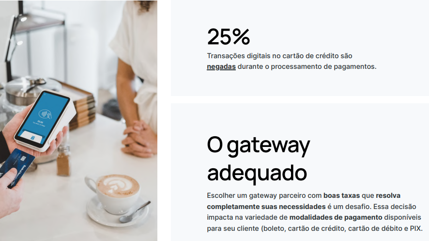
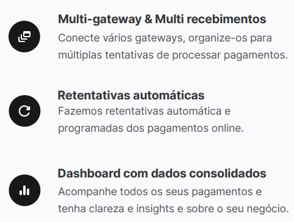
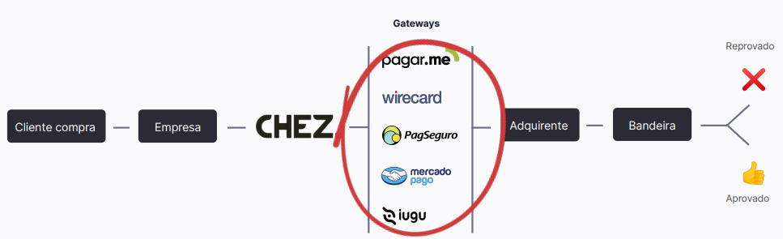
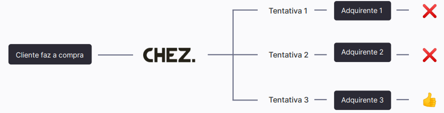

# Chez Payments, método de pagamento para Magento 2

Somos a [**Chez**](https://www.chez.group/)! Um hub multigateways para pagamentos digitais.

Com a Chez você tem a liberdade na escolha da sua rota de recebimentos digitais, com mais segurança e com menores taxas.

## Qual o problema?

## Nossa solução

## Como funciona

## Retentativas automáticas

## Formas de recebimento

- Boleto
- Cartão de crédito
- Cartão de débito
- PIX.

## Gateways aceitos

- wirecard
- iugu
- PagSeguro
- Mercado pago
- Pagar.me

## Bandeiras de cartão

- Visa
- Mastercard
- Hiper
- American Express
- Diners Club
- Elo

## Lojas virtuais ecommerce

- Magento
- Loja integrada
- Tray
- Vtex
- Nuvem shop

## Outros recursos

- Políticas de parcelamento: Domine e defina promoções e condições de juros no parcelamento.
- Anti-fraude: Integrado junto ao gateway, com toda a segurança e confiabilidade do PCI compliance.
- Integrações com lojas virtuais: Conexão com as maiores lojas virtuais do mercado.
